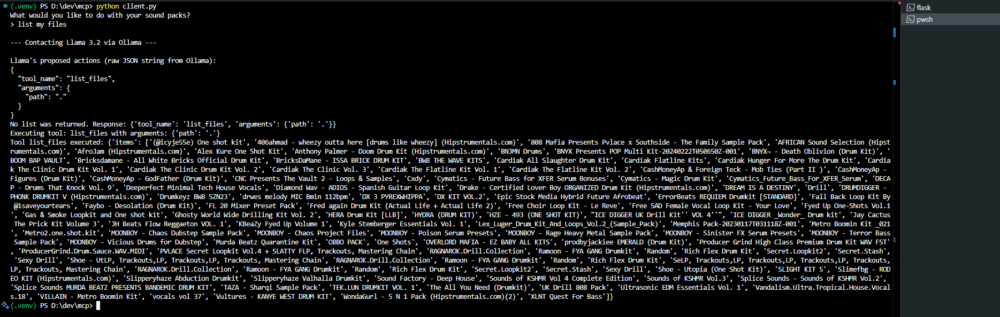

# MCP_Project

A simple Python project that uses a local Llama LLM (via Ollama) to list files in a directory you specify. It has a Flask server that provides a file-listing tool and a client that talks to the LLM and then the server.

---
## Files

* `server.py`: The Flask server that runs the tool.
* `client.py`: The script you run to give commands to the LLM.
* `tools.py`: Defines the `list_files` tool and where you set your target directory.

---
## Setup

1.  **Get the Code:**
    ```bash
    git clone [https://github.com/AimanMadan/MCP_Project.git](https://github.com/AimanMadan/MCP_Project.git)
    cd MCP_Project
    ```

2.  **Python Virtual Environment (Recommended):**
    ```bash
    python -m venv .venv
    ```
    After this, you'll need to activate it each time you open a new terminal for this project (see "How to Run" section).

3.  **Install Necessary Packages:**
    Once your virtual environment is created and activated (see step 1 in "How to Run" for activation):
    ```bash
    pip install Flask ollama requests
    ```

4.  **Set up Ollama & Llama:**
    * Make sure Ollama is installed and running on your computer.
    * Pull the Llama model you'll use (the client is likely set up for `llama3.2:3b` or a similar one):
        ```bash
        ollama pull llama3.2:3b
        ```
        *(Make sure the model name in `client.py` matches what you have installed.)*

---
## Configuration - IMPORTANT Before Running!

1.  **Tell the Project Which Folder to Scan:**
    * Open the `tools.py` file in a text editor.
    * Find the line that looks like this:
        ```python
        my_sounds = "F:/My Packs" # Or some other default path
        ```
    * **Change the path in the quotes** (e.g., `"F:/My Packs"`) to the **full path of the directory whose contents you want to display**.
        * Example for Windows: `my_sounds = "C:/Users/YourName/Documents/MyMusicKits"`
        * Example for macOS/Linux: `my_sounds = "/home/yourname/sound_library"`
    * Save the `tools.py` file.

---
## How to Run

You'll need two separate terminal/PowerShell windows open.

**1. Start the Server (`server.py`):**

* Open your first terminal/PowerShell window.
* Navigate to your project directory (if you're not already there):
    ```bash
    cd path\to\your\MCP_Project
    ```
* Activate your virtual environment:
    * **Windows (PowerShell/CMD):**
        ```powershell
        .\.venv\Scripts\activate
        ```
    * **macOS/Linux (Bash/Zsh):**
        ```bash
        source .venv/bin/activate
        ```
* Run the Flask development server:
    ```bash
    flask --app server run
    ```
* You should see messages indicating the server is running (e.g., on `http://127.0.0.1:5000`).
* **Leave this terminal open and the server running.**

**2. Run the Client (`client.py`) (while the server is running):**

* Open a **new (second)** terminal/PowerShell window.
* Navigate to your project directory:
    ```bash
    cd path\to\your\MCP_Project
    ```
* Activate your virtual environment in this new terminal too:
    * **Windows (PowerShell/CMD):**
        ```powershell
        .\.venv\Scripts\activate
        ```
    * **macOS/Linux (Bash/Zsh):**
        ```bash
        source .venv/bin/activate
        ```
* Run the client:
    ```bash
    python client.py
    ```
* The client will ask: `What would you like to do with your sound packs?`
* Type a command, for example: `show my files` or `list all files`.
* The client will then contact the Llama model, then the server, and should display the list of files from the directory you configured in `tools.py`.

```markdown
---
## Example Output



---
